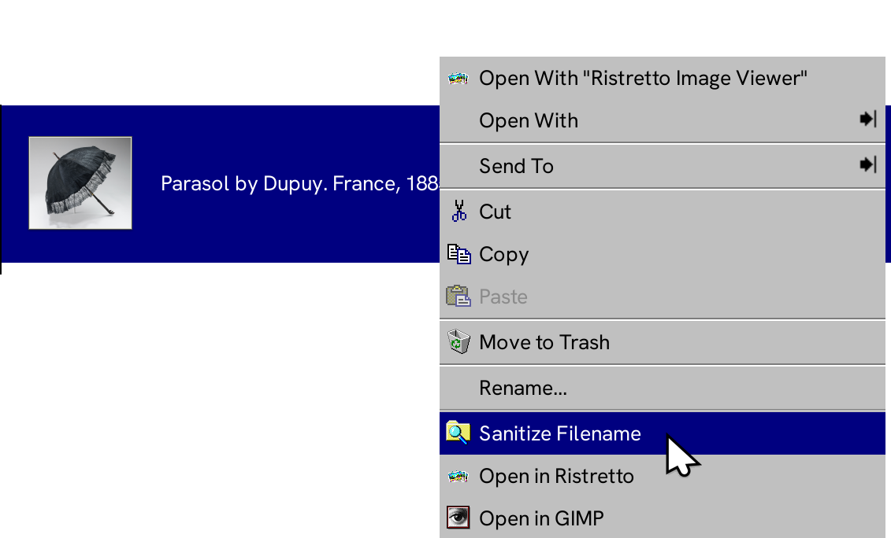
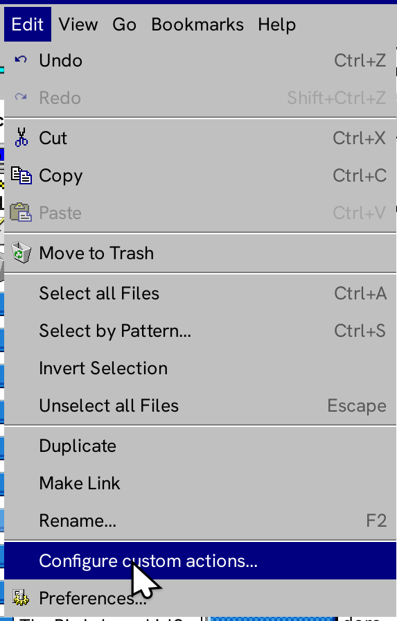
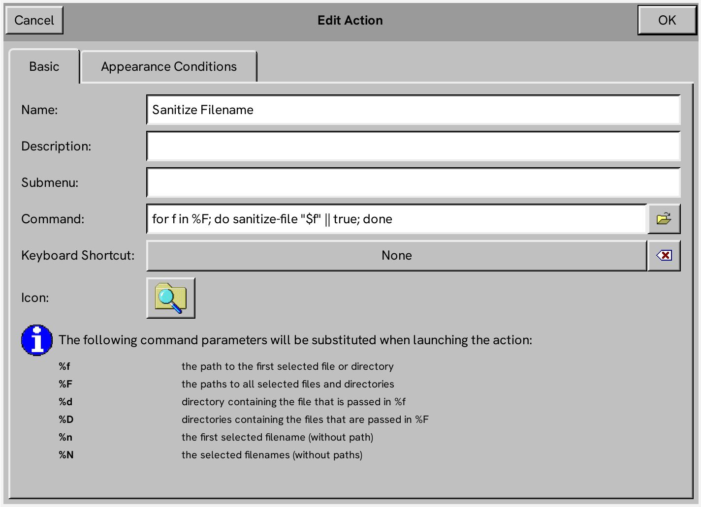
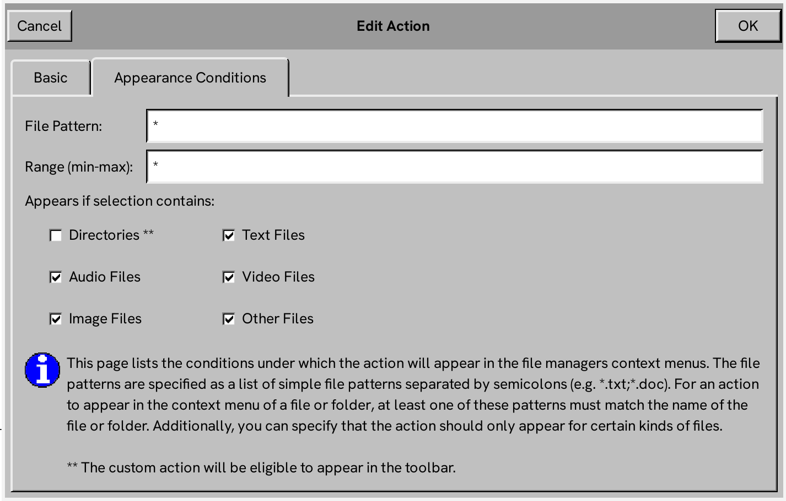

# `sanitize-filename` terminal utility in bash

[![No Maintenance Intended]][no-maintenance]

[No Maintenance Intended]: https://img.shields.io/badge/No%20Maintenance%20Intended-%F0%9F%97%99-red
[no-maintenance]: https://unmaintained.tech/

Convert spaces to underscores, trims punctuation parentheses etc and leading/ending whitespaces.

For GUI, it uses `zenity`.

## Use

* Use as `env NO_GUI=sth sanitize-filename [...]` to disable GUI.
* Use as `env verbose=true sanitize-filename [...]` to enable verbose debugging messages.
* Use as `env dry_run=true sanitize-filename [...]` to not actually perform any filesystem operations.

## Add to Thunar's context menu as an action

End result:

1. Open the custom actions menu.
    
   
2. Create a new action and set these values.
    
   
    
   
